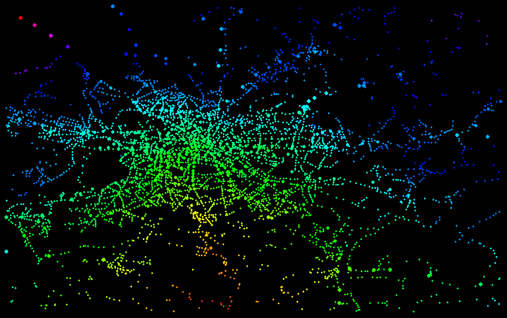

# Traincoloureur
## Preamble


The aim of this little python programme is the colourful visualisation of public transport distances in Berlin and Brandenburg.
It shows distances from a certain station (by default _Dabendorf Centralstation_) represented by a rainbow scale (customizable).

## Prerequisites
The programme runs on Python 3, using the _pygame_ framework.
```console
python3 -m pip install -U pygame --user
```

### Optional: Load new vbb data
We thankfully use the [Generate-vbb-graph](https://github.com/derhuerst/generate-vbb-graph/) javascript framework by [derhuerst](https://github.com/derhuerst/) for obtaining the official VBB station data and distances.
The programme already includes those files, there is no need to run those files. If you want newer data than included in the project, you can download them by running the following commands:

### Optional: Installing nodejs and generate-vbb-graph
```console
sudo apt install npm
sudo npm install -g generate-vbb-graph
sudo npm install -g vbb-graph
```

Now, it is possible to obtain the station data by running the following command:
```console
generate-vbb-graph -p suburban,subway,regional,tram,ferry,bus
```

Please insert the _edges.ndjson_ and _nodes.ndjson_ into the main folder.

## Running Traincoloureur
You can run the traincoloureur with the following command:
```console
python3 tools.py 
```

## Custom Flags
It is possible to select a different start station by using the `-s` flag. It uses abbreviations saved in `shortcuts.csv`.

Feel free to add more station abbreviations. The `station_ids` can be obtained from _nodes.ndjson_,
for example _900000193002_ for _S Adlershof_
```console
python3 tools.py -s berlinhbf
```
```console
python3 tools.py -s ahof
```

It is possible to change the size of the dots the map. There are three different sizes for regional/local trains (RE/RBB), metros (S/U) and tramway/bus, separated by commas.
```console
python3 tools.py -p 6,5,2
```

It is possible to change bounding box of the window. The bounding box is rectangular and describes the GPS data which is visible within the programme. By default, this is the area of Berlin. There is also a custom command for the entire VBB-area (Berlin-Brandenburg.)
```console
python tools.py -b brb
```
```console
python tools.py -b 13.3,13.8,52.5,52.5
```

Change the height of the programme window. The width gets changed automatically, dependent on the bounding box and the correct proportions.
```console
python3 tools.py -height 1500
```

It is possible to change the number of iterations around the default rainbow scale. Default 0.8
```console
python3 tools.py -i 2.0
```

## Further customisation 
There are some parameters included in the _tools.py_, which are not available as commandline parameters yet. Feel free to include that functionality!

It possible to change the colour skale which the distance function is dependant from.

Changing the last line changes the colour of the starting station.
```python
if distance_array[i] != 0:
	start = 0  # 102.8 Start colour in Dabendorf, degrees from red
	spectreSize = 0.8  # number of iterations around rainbow, preferibly < 1.0
	hue = ((((distance_array[i] - min)/rangemm) +
		(((start/360)*255)/255)) % 1)*spectreSize

	colours[i] = hsv2rgb(hue, 1.0, 1.0)
else:
	colours[i] = (51, 178, 0)  # DORgreen, 33b200
     
 ```
 
It is of course possible to change the code in a way to not make it dependent from a floating range but if-else conditions.
